**完整代码收费 +   316595344     或    lz316595344  咨询**

**接毕业设计和论文**

**如果图片加载不出来可以去博客看 https://blog.csdn.net/qq_56450993/article/details/133308798**

**毕业设计所有选题地址**

**[github]👉https://github.com/XinChennn/allProjects**

**[忻辰的个人博客]👉https://www.ixinjiu.cn/articles/156**

## 基于springboot+vue的宠物交易系统

## 一、系统介绍

包括管理员、普通用户两种角色，外加游客(未登录情况)

权限  游客 < 普通用户 < 管理员

1、游客功能

查看宠物信息

2、普通用户功能

出售/领养宠物、购买/收养宠物、订单管理、地址管理

和卖家/卖家对话

个人信息修改、密码修改

3、管理员功能

用户管理、地址管理、宠物管理、订单管理

个人信息、密码修改

## 二、所用技术

后端技术栈：

-  springboot + mybatis + mysql

前端技术栈：

- vue

## 三、环境介绍

基础环境 :IDEA/eclipse, JDK 1.8, Mysql5.7及以上,Maven

所有项目以及源代码本人均调试运行无问题 可支持远程调试运行

## 四、页面截图

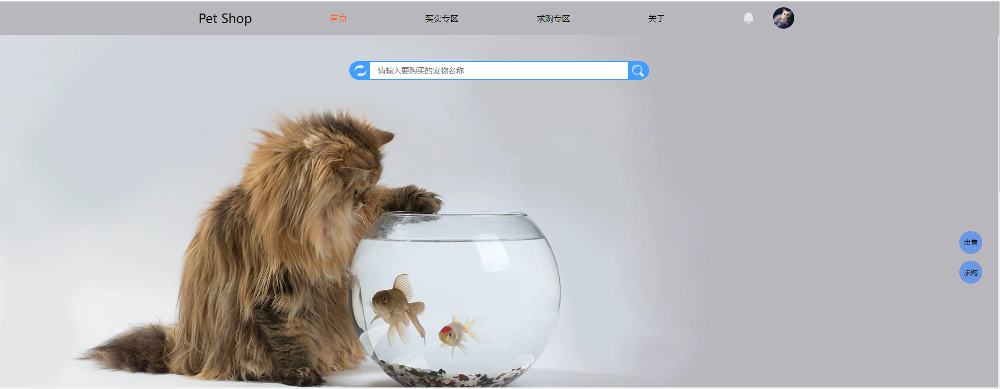

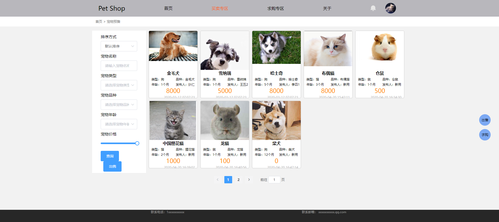

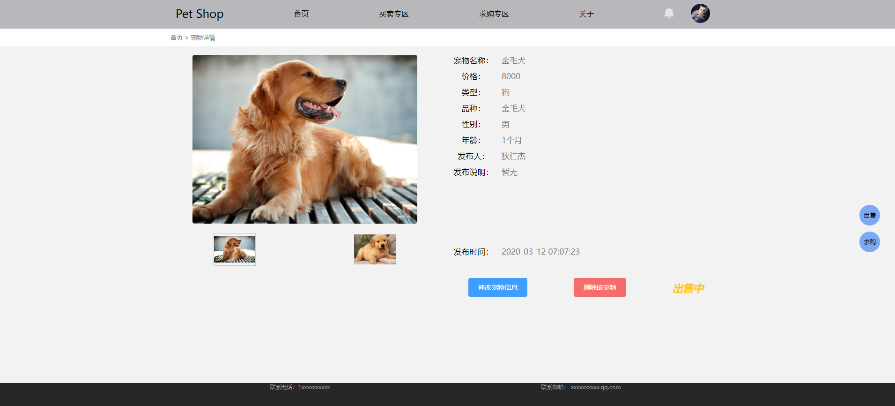

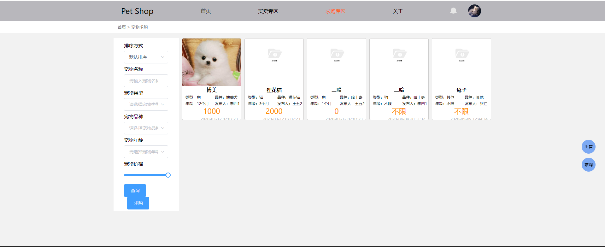

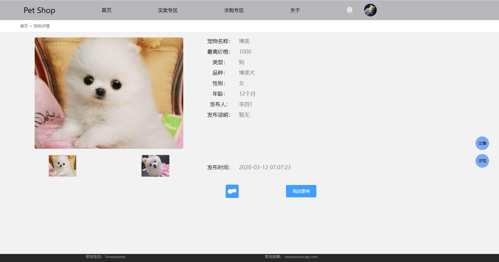

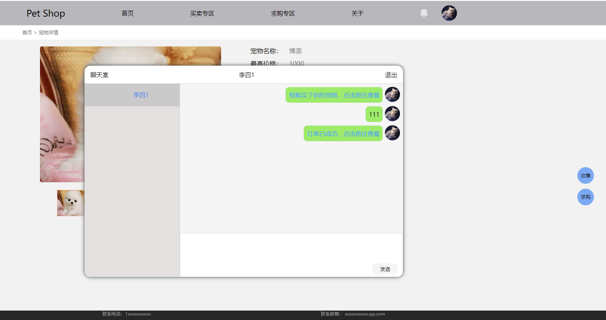

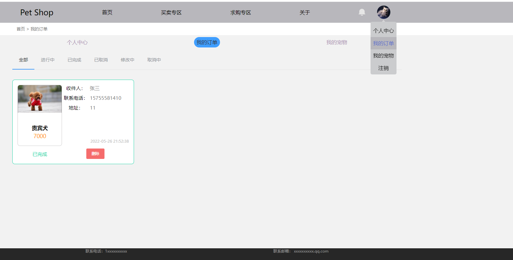

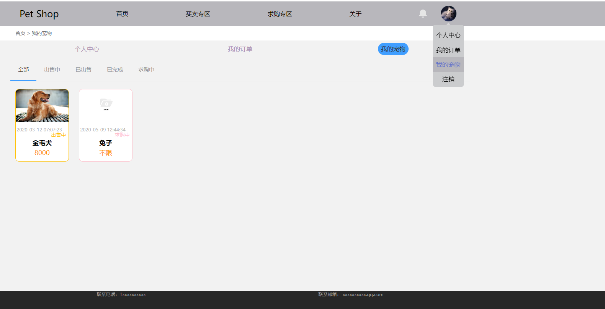

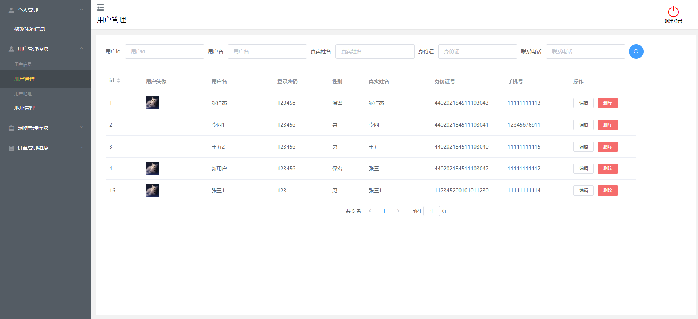

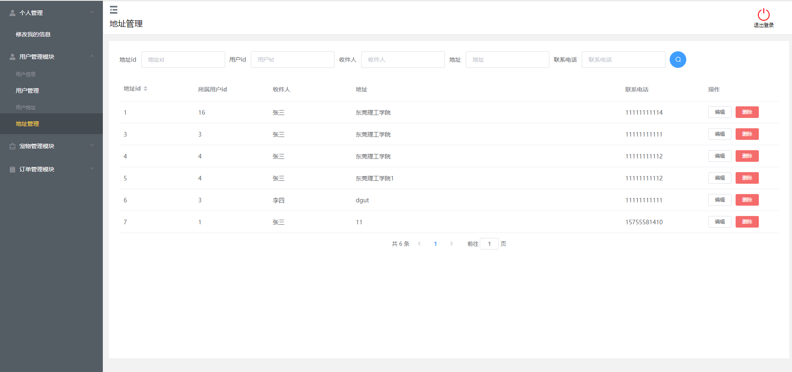

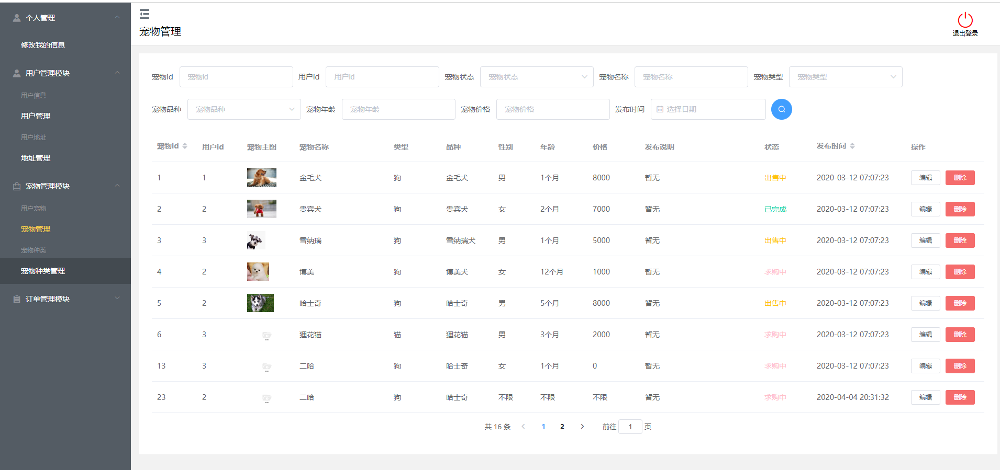

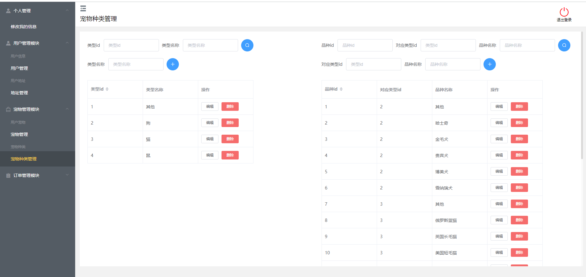

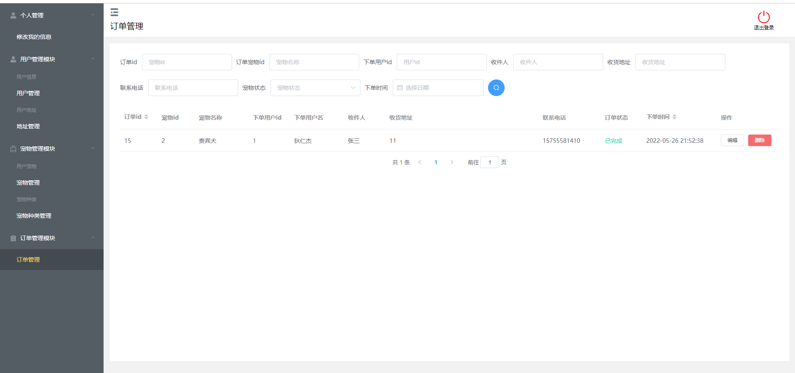

## 五、浏览地址

登录地址  http://localhost:8080/home

普通用户： 用户名：李四1   密码：  123456

管理员       用户名：管理员  密码：123456

## 六、安装教程

1. 使用Navicat或者其它工具，在mysql中创建对应名称的数据库，并导入项目db文件夹的sql文件(联系作者获取)；
2. 使用IDEA/Eclipse/MyEclipse导入项目，Eclipse/MyEclipse导入时，若为maven项目请选择maven;
   若为maven项目，导入成功后请执行maven clean;maven install命令，然后运行；
3. 修改application.yml 里面的数据库配置
4. 启动项目后端项目
5. vscode打开pettrading项目
6. 打开终端，执行npm install 依赖下载完成后执行 npm run dev或npm run serve,执行成功后会显示访问地址
7. 访问  http://localhost:8080/home

**需要完整代码 +   316595344     或    lz316595344  咨询**